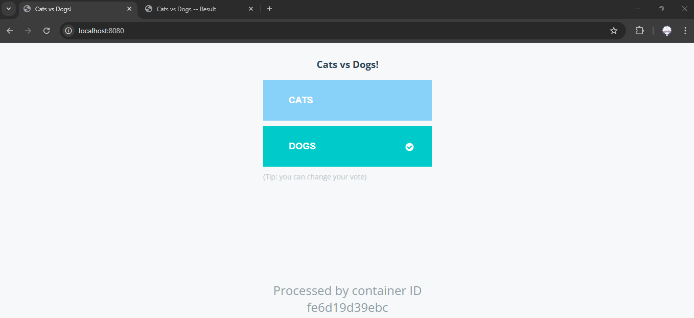
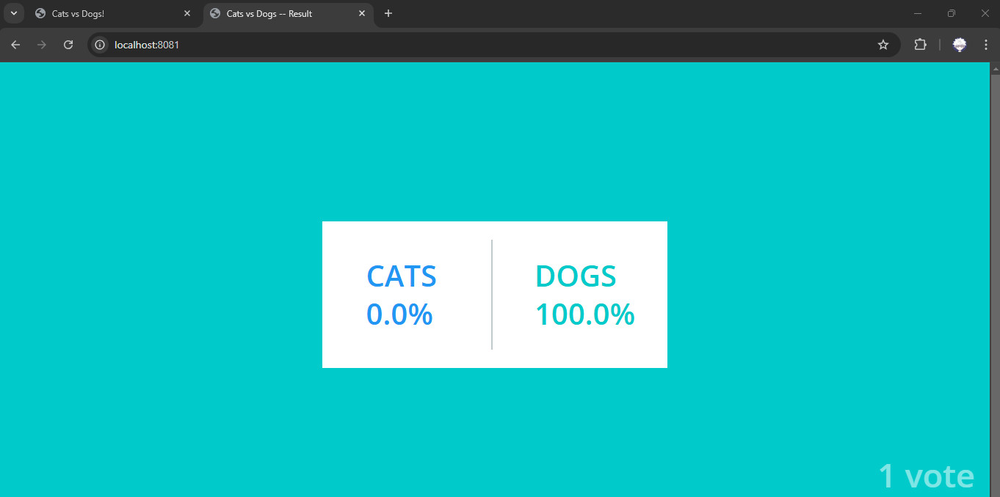
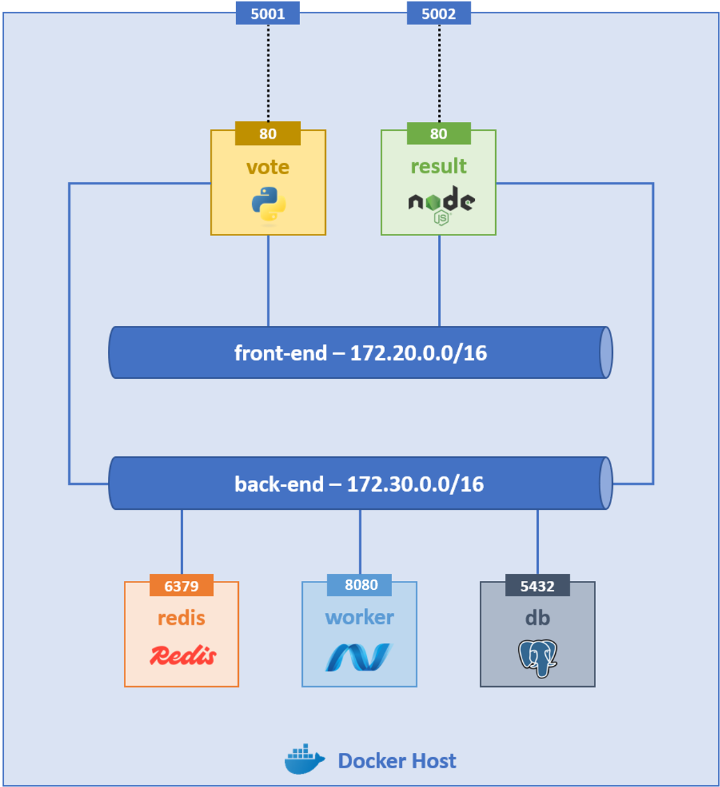
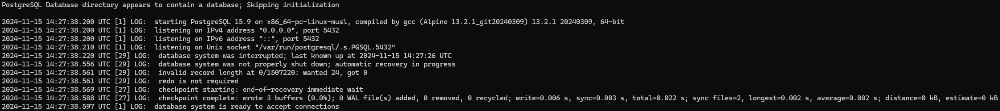
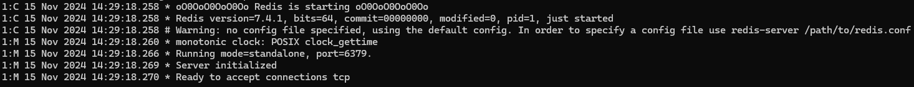
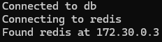
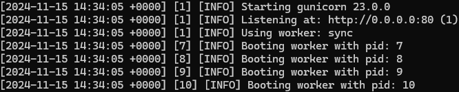
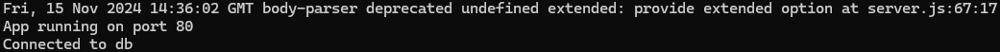
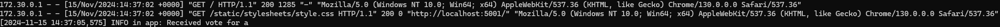
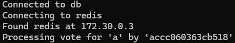

# Lab 1 - Création d'une application multi-conteneurs avec la CLI Docker

## 1. Présentation de l'application

### a. L'application

Vous allez créer une application web qui contient 2 pages distinctes :

- **Vote** - permet de voter pour **CATS** et **DOGS**
- **Resultat** - affiche le résultat en pourcentage des votes

Aperçu de la page de vote :

Aperçu de la page de résultat :

L'application n'accepte qu'un vote par navigateur et chaque vote est changeable.

### b. Architecture

L'architecture est composée des éléments suivants :

- **Réseau front-end** - destiné aux conteneurs accessibles depuis l'extérieur
- **Réseau back-end** - destiné aux conteneurs non accessibles depuis l'extérieur
- **vote** - conteneur qui publie la page de vote sur le port 5001 du docker host
- **result** - conteneur qui publie la page de résultat sur le port 5002 du docker host
- **redis** - conteneur qui reçoit les votes du conteneur vote et les transmet au worker
- **worker** - conteneur tampon qui reçoit les votes du conteneur redis et les inscrit dans la base de données
- **db** - base de données qui stocke les votes

## 2. Build des images

### a. Vote

Le répertoire [vote/](./src/vote/) contient l'application qui fournit la page de vote.

Buildez la version **1.0** de l'image custom **vote** en respectant les caractéristiques suivantes :

- L'image de base doit être la version **3.11-slim** de l'image **python**

- Le répertoire **[static/](./src/vote/static/)** doit être copié dans le répertoire **/usr/local/app** de l'image

- Le répertoire **[template/](./src/vote/template/)** doit être copié dans le répertoire **/usr/local/app** de l'image

- Les fichiers **[app.py](./src/vote/app.py)** et **[requirements.txt](./src/vote/requirements.txt)** doivent être copiés dans le répertoire **/usr/local/app** de l'image

- Les paquets listés dans le fichier requirements.txt doivent être installés dans l'image via la commande `pip install --no-cache-dir -r requirements.txt`

- La variable d'environnement **PYTHONPATH** doit avoir la valeur **/usr/local/app:$PYTHONPATH**

- La commande suivante doit être lancée au démarrage : `gunicorn app:app -b 0.0.0.0:80 --log-file - --access-logfile - --workers 4 --keep-alive 0`

### b. Result

Le répertoire [result/](./src/result/) contient l'application qui fournit la page de résultat.

Buildez la version **1.0** de l'image custom **result** en respectant les caractéristiques suivantes :

- L'image de base doit être la version **18-slim** de l'image **node**

- Le répertoire **[views/](./src/result/views/)** doit être copié dans le répertoire **/usr/local/app** de l'image

- Les fichiers **[package-lock.json](./src/result/package-lock.json)**, **[package.json](./src/result/package.json)** et **[server.js](./src/result/server.js)** doivent être copiés dans le répertoire **/usr/local/app** de l'image

- Les commandes `apt-get update && apt-get install -y tini`, `npm install -g nodemon` et `cd /usr/local/app && npm ci && npm cache clean --force && mv /usr/local/app/node_modules /node_modules` doivent être exécutées

- La variable d'environnement **PORT** doit avoir pour valeur **80**

- La commande suivante doit être lancée au démarrage : `/usr/bin/tini -- node server.js` (passez `/usr/bin/tini --` en ENTRYPOINT et `node server.js` en CMD).

### c. Worker

Le répertoire [worker/](./src/worker/) contient l'application qui permet de lire les votes dans le cache redis et les écrire dans la base de données PostgreSQL. Ce répertoire contient également le **[Dockerfile](./src/worker/Dockerfile)** permettant de build l'image.

Buildez la version **1.0** de l'image custom **worker** à l'aide de ce Dockerfile.

### d. Redis et Db

Nous utiliserons directement les images [redis](https://hub.docker.com/_/redis) et [postgres](https://hub.docker.com/_/postgres) du Docker Hub pour créer les conteneurs correspondant.

## 3. Création des réseaux

Créez les 2 réseaux suivants :

- Front-end
    - **Nom** - front-end
    - **Adresse de sous-réseau** - 172.20.0.0/16
    - **Driver** - bridge

- Back-end
    - **Nom** - back-end
    - **Adresse de sous-réseau** - 172.30.0.0/16
    - **Driver** - bridge

## 4. Création du volume

Créez un volume nommé **db-data**. Ce volume sera utilisé par la base de données pour y persister ses données.

## 5. Création des conteneurs

Afin d'observer leurs logs en direct, chaque conteneur sera lancé dans une fenêtre Powershell dédiée et en non-détaché.

Créez les conteneurs suivants en respectant l'ordre de leur listing :

- Base de données
    - **Nom** - db
    - **Image** - postgres
    - **Version de l'imgage** - 15-alpine
    - **Valeur de la variable d'environnement POSTGRES_USER** - postgres
    - **Valeur de la variable d'environnement POSTGRES_PASSWORD** - postgres
    - **Réseaux** - back-end
    - **Volume** - Utilisation du volume **db-data** pour persister les données contenues dans le répertoire **/var/lib/postgresql/data**

- Redis
    - **Nom** - redis
    - **Image** - redis
    - **Version de l'imgage** - alpine
    - **Réseaux** - back-end

- Worker
    - **Nom** - worker-app
    - **Image** - worker
    - **Version de l'imgage** - 1.0
    - **Réseaux** - back-end

- Vote
    - **Nom** - vote-app
    - **Image** - vote
    - **Version de l'imgage** - 1.0
    - **Réseaux** - front-end et back-end
    - **Port-binding** - Port **80 du conteneur** avec le port **5001 du Docker Host**

- Result
    - **Nom** - result-app
    - **Image** - result
    - **Version de l'imgage** - 1.0
    - **Réseaux** - front-end et back-end
    - **Port-binding** - Port **80 du conteneur** avec le port **5002 du Docker Host**

## 6. Test de l'application

- Accédez à la page de vote via l'URL **http://localhost:5001**
- Votez pour **CATS** ou **DOGS**
- Accédez à la page de résultat via l'URL **http://localhost:5002**
- Vérifiez que votre vote a bien été pris en compte dans les résultats

Analysez les logs des conteneurs **vote-app** et **worker-app** et confirmez qu'ils correspondent bien aux actions que vous avez réalisé :

Félicitations, vous venez de déployer votre première application reposant sur une architecture dite de micro-services !